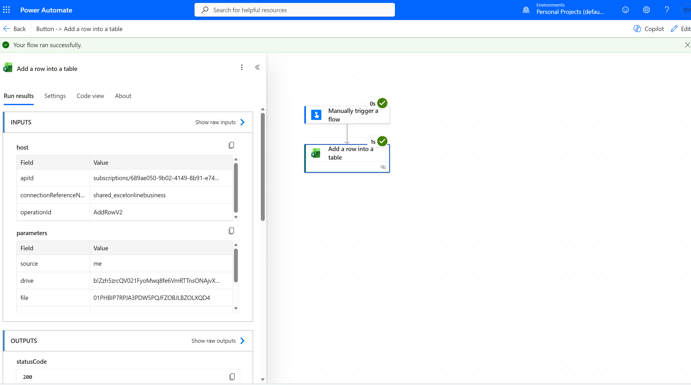

# Deepak Verma - Technical Portfolio

Welcome to my technical portfolio.

I am a Senior Analyst with experience in quality monitoring and business operations. I am currently developing skills in Power Automate, SQL, Power BI, Power Apps, Microsoft Forms, and SharePoint.

This repository contains my hands-on projects and learning exercises.

## Power Automate Projects

### 1. Power Automate - Excel Data Entry Automation

**Objective:**
Automate the process of adding data into an existing Excel table using Microsoft Power Automate.

**Tools Used:**

* Microsoft Power Automate
* Microsoft Excel Online
* Microsoft 365

**Skills Demonstrated:**

* Flow Creation
* Excel Online Connector
* Triggers and Actions
* Workflow Testing

**Status:**
Completed (Personal Project)

#### Workflow Screenshot

----

### 2. Power Automate - Email to Excel Automation

**Objective:**
Automatically capture details from incoming emails and add them to an Excel table.

**Tools Used:**

* Power Automate
* Outlook
* Excel Online (Business)

**Skills Demonstrated:**

* Email Triggers
* Excel Online Connector
* Workflow Automation

**Status:**
Completed (Personal Project)

#### Workflow Screenshot

---

### 3. Power Automate - Microsoft Forms to Excel Automation

**Objective:**
Automatically store Microsoft Forms responses into an Excel table for centralized record management.

**Tools Used:**

* Power Automate
* Microsoft Forms
* Excel Online (Business)

**Skills Demonstrated:**

* Forms Integration
* Excel Automation
* Automated Data Collection

**Status:**
Completed (Personal Project)

---

### 4. Power Automate - Excel to Microsoft Teams Notification

**Objective:**
Automatically send a Microsoft Teams channel notification whenever a selected Excel row is processed.

**Tools Used:**

* Power Automate
* Excel Online (Business)
* Microsoft Teams

**Skills Demonstrated:**

* Teams Integration
* Excel Connector
* Automated Notifications

**Status:**
Completed (Personal Project)

---

### 5. Power Automate - SharePoint Notification Workflow

**Objective:**
Automatically send a Microsoft Teams notification and an email whenever a new SharePoint list item is created.

**Tools Used:**

* Power Automate
* SharePoint
* Microsoft Teams
* Outlook

**Skills Demonstrated:**

* SharePoint Trigger
* Teams Integration
* Email Automation
* Multi-step Workflow

**Status:**
Completed (Personal Project)

More projects will be added as I continue my learning journey
